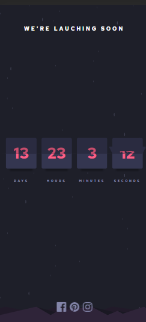
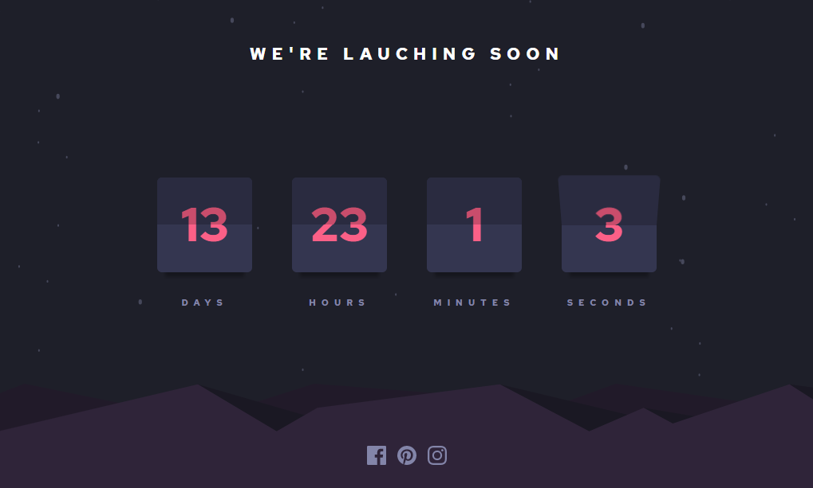

# Frontend Mentor - Launch countdown timer solution in Next/React

This is a solution to the [Launch countdown timer challenge on Frontend Mentor](https://www.frontendmentor.io/challenges/launch-countdown-timer-N0XkGfyz-). Frontend Mentor challenges help you improve your coding skills by building realistic projects.


## Table of contents

- [Overview](#overview)
  - [The challenge](#the-challenge)
  - [Screenshot](#screenshot)
  - [Links](#links)
- [My process](#my-process)
  - [Built with](#built-with)
  - [What I learned](#what-i-learned)
- [Author](#author)
- [Acknowledgments](#acknowledgments)
- [Where to find everything](#Where-to-find-everything)
- [Development](#Development)
- [Getting Started](#Getting-Started)

## Overview

## The challenge

Users should be able to:

- See hover states for all interactive elements on the page
- See a live countdown timer that ticks down every second (start the count at 14 days)
- When a number changes, make the card flip from the middle

## Screenshot




### Links

- Live Site URL: [https://countdown-challenge-one.vercel.app/](https://countdown-challenge-one.vercel.app/)
- How to setup styled-components with Next: https://dev.to/aprietof/nextjs--styled-components-the-really-simple-guide----101c

## My process

### Built with

- [Next.js](https://nextjs.org/) - React framework
- [React](https://reactjs.org/) - JS library
- [Styled Components](https://styled-components.com/)
- Semantic HTML5 markup
- CSS custom properties
- Flexbox

### What I learned

This is my second project using Next. The first was during an event called [Next Level Week](https://nextlevelweek.com/pre-nlw) made by [Rocketseat](https://rocketseat.com.br/), a big programming event in Brazil for front-end developers (with React) and back-end (with NodeJS/Elixir). This was the 4th event they made and the first one to have Nextjs. The resulting project is on [Github](https://github.com/Erick-Oliveira-ET/NLW4/tree/main/frontend-next) as NLW4 and is [Live](https://movit-et.vercel.app/) (I use it dayly).

In this project was the first time I used Next on my own, even though I have a lot of experience with React. I didn't have any trouble since I learned pretty well from the event but I have to say that programming using Next is beautiful: the hotreload is smooth, doesn't reload the entire page and is really fast what is great because the cold start of a programmer is the main reason for procrastination.

A very important thing I learned in this project is to never let fill on the svg tag, it makes impossible to work with coloring the icons.

I also learned that sometimes I have to write my thoghts down to not overengineer and do it in the wrong way and lose time. I say that because of a bit of code in [cardFlip.tsx](./components/cardFlip.tsx) that I complicated too much and in the end was really simple (maybe there's a more simple way but I don't have this knowledge yet):

```typescript
useEffect(() => {
  setFlip(true);

  setFlipDisplayTop(number);
  setFlipperBottom(number);

  setTimeout(() => {
    setFlipDisplayBottom(number);
    setFlipperTop(number);

    setFlip(false);
  }, 900);
}, [number]);
```

## Author

- Linkedin - [@erick-t-oliveira](https://www.linkedin.com/in/erick-t-oliveira/)
- Github - [Erick_Tomaz_ET](https://github.com/Erick-Oliveira-ET)
- Frontend Mentor - [@Erick-Oliveira-ET](https://www.frontendmentor.io/profile/Erick-Oliveira-ET)
- Instagram - [@erick_tomaz_kz](https://www.instagram.com/erick_tomaz_kz/)

## Acknowledgments

I have to thanks Arthur Bello ([ThurzinRB](https://github.com/ThurzinRB)) for showing me this challenge and suporting me in the process and Eliabe Vinicius ([eliabevces](https://github.com/eliabevces)) for being the code tester and point out my mistakes.

## Where to find everything

The task is to build out the project to the designs inside the `.github/images` folder. There`s both a mobile and a desktop version of the design.

There is also a `style-guide.md` file containing the information given to the project, such as color palette and fonts.

## Development

This is a [Next.js](https://nextjs.org/) project bootstrapped with [`create-next-app`](https://github.com/vercel/next.js/tree/canary/packages/create-next-app).

## Getting Started

First, run the development server:

```bash
npm run dev
# or
yarn dev
```

Open [http://localhost:3000](http://localhost:3000) with your browser to see the result.

You can start editing the page by modifying `pages/index.js`. The page auto-updates as you edit the file.

In the `components/cardFlip.tsx` is the component for one of the card flip numbers systems. It works using `useEffect` in the props "number" and knowing the time of the flip to change the number in the front of the card in the right time.

In the `styles/globals.css` are the global variables and some global configuration as well as the responsivity part being a single media that changes the font-size.

In the `styles/Home.ts` is every styling using [Styled Components](https://styled-components.com/).
